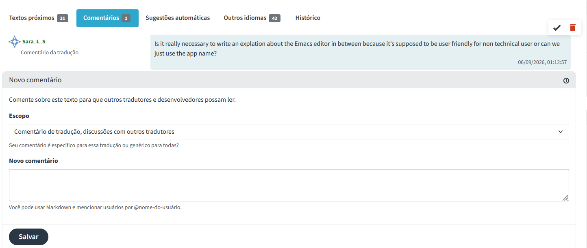

# Dia 00/08/2026

Projeto de software livre escolhido: "Back in time"

Depois de ler sobre a demanda de tradução da applicação para português, entrei ([github do Back In Time](https://github.com/bit-team/backintime) e li as intruções de contribuição como tradutora. 

Passei pelo menos 1 hora lendo documentações sobre o projeto e a ideia principal dele é de manter o backup de arquivos de forma eficiente, utilizando hardlinks para economizar memória entre versões de backup diferentes, por meio de um mecanismo que reconhece quais arquivos se repetiram para que não seja salva uma nova cópia do mesmo arquivo em várias versões da cópia de dados de segurança. O mais interessante é a numeração dessas versões para que se possa fazer a recuperação de arquivos de forma mais dinâmica.

Entre as regras de tradução e orientações gerais, estão incluídas:
- Proibição do uso de IA para as traduções
- Tradução voltada ao público leigo, com o mínimo de jargão tecnológico possível.
- Realizar revisões nas traduções marcadas como "revisão necessária".

Após análise das regras, segui para fazer a conta no [site de tradução](https://codeberg.org) e prossegui à aba de apresentação dos tradutores, onde cada contribuidor colocou seu nome e salvou. A plataforma do Codeberg é bem simples no seu uso geral de observar quais traduções ainda precisam ser feitas, apenas necessitando clicar no ícone de traduzir na seção de "não traduzidos".

Realizei um total de 72 traduções ao longo dessa semana, precisando parar em muitos momentos devido à necessidade de entender como traduzir certos jargões específicos de ferramentas Linux que nunca utilizei, além de ter que aprender termos que nunca ouvi antes, como os tão mencionados hard links. As palavras udev (software responsável por gerenciar dispositivos externos, que é um componente do núcleo do Linux), hard link e muitas outras trouxeram desafios que eu, como poliglota entusiasta de idiomar, nunca havia enfrentado. 

Existe sempre o dilema de traduzir para deixar o nome de um componente mais intuitivo e acabar dificultando funcionalidades para quem sempre mexeu nelas sem tradução, claro, mas também existem problemas quando o inglês possui expressões idiomáticas únicas que traduzidas viram jargões técnicos, que provavelmente não seriam bem compreendidos pelo usuário comum. Um desses exemplos emblemáticos da minha jornada de tradução foi a palavra "mount/unmount'. A princípio, observada sem o devido cuidado, vira a palavra "montar", mas como tenho experiência com a língua o suficiente para perceber que a frase em que estava inserida exigia outro significado. Uma pesquisa mais extensa do que as demais me levou a entender que era algo muito específico do fuincionamento dos diretórios Linux. Mount traduzido de forma simples e mais intuitiva, seria "associar um sistema de arquivos a um diretório", unmount seria o efeito oposto, desassociar, tornando o arquivo inacessível. No entanto, as traduções diretas frequentemente eram mais técnicas que isso.

A tradução era algo que eu esperava que fosse simples e rápido, mas a quantidade de traduções e a quantidade de pesquisa envolvida me surpreenderam bastante.

Depois de alguns dias, somente, percebi que seria necessário entrar em contato direto com os desenvolvedores do projeto para tirar minhas dúvidas, porque não sabia que canal usar para entrar em contato. Para isso, fiz isso de um e-mail que foi utilzado para enviar o pedido de contribuição que o professor Daniel Cordeiro enviou por e-mail para contatá-los. Depois de enviar o e-mail, finalmente descobri o sistema de comentários da própria plataforma de tradução e mandei uma observação. Devido ao fato de entender as traduções em todos os idiomas presentes ali, achei que a tradução em Português poderia melhorar retirando a explicação sobre o aplicativo específico ali mencionado, que para mim não faz sentido, mas foi feito por outro tradutor do projeto. 

